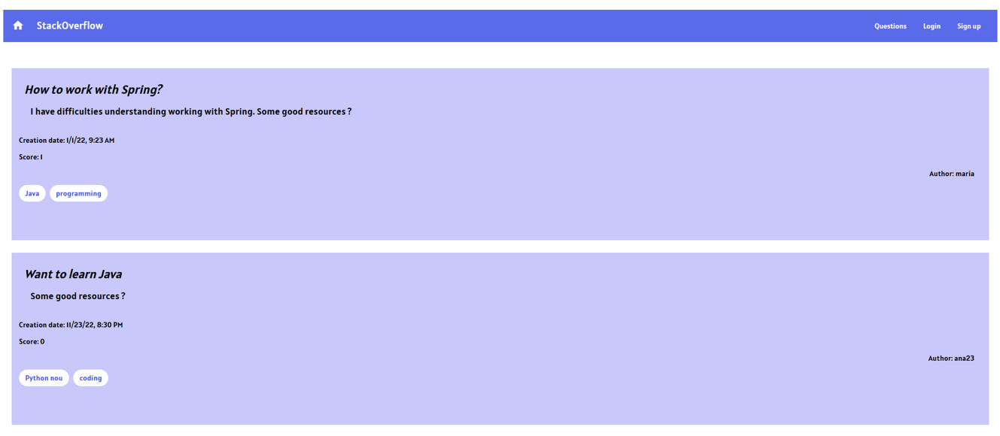

# Stackoverflow

This project was generated with [Angular CLI](https://github.com/angular/angular-cli) version 12.2.11.

## Development server

Run `ng serve` for a dev server. Navigate to `http://localhost:4200/`. The app will automatically reload if you change any of the source files.

## Code scaffolding

Run `ng generate component component-name` to generate a new component. You can also use `ng generate directive|pipe|service|class|guard|interface|enum|module`.

## Build

Run `ng build` to build the project. The build artifacts will be stored in the `dist/` directory.

## Running unit tests

Run `ng test` to execute the unit tests via [Karma](https://karma-runner.github.io).

## Running end-to-end tests

Run `ng e2e` to execute the end-to-end tests via a platform of your choice. To use this command, you need to first add a package that implements end-to-end testing capabilities.

## Further help

To get more help on the Angular CLI use `ng help` or go check out the [Angular CLI Overview and Command Reference](https://angular.io/cli) page.

# About the project 
The implementation of the backend part of the project is composed of the basic CRUD operation performed on a database that contains the questions, answers, users and votes. The Backend is found on a private repository, people who are interested could send me a message and I will gladly share it with them.

## Languages and Frameworks used: 
 ### Backend: 
 * Java Spring Boot
 * MySQL Database
 ### Frontend
 * Angular
 

A few screenshots from the application

Landing page

Login page

Register page

Profile page

Question list

Ask a question 

The user can ask a question, introducing helpful tags that could help when filtering questions

My question 

The user can edit or delete it's own question. The users can also like or dislike an answer, but they cannot like or dislike his own question, only offer an answer to it.

Edit question 

